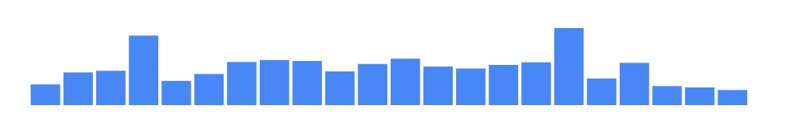
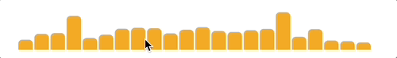
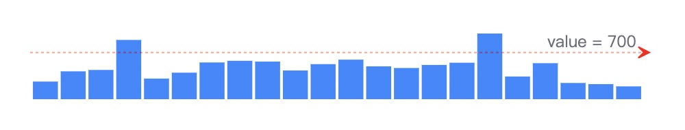

# @strawberry-vis/g2-tiny-bar

The tiny bar mark for [@antv/g2 5.0](https://github.com/antvis/g2).



## Installing

For package mangers, such as NPM or Yarn:

```bash
$ npm install @strawberry-vis/g2-tiny-bar
```

```js
import { Chart } from "@antv/g2";
import { TinyBar } from "@strawberry-vis/g2-tiny-bar";

const chart = new Chart({
  container: "container",
});

chart.options({
  type: TinyBar,
  width: 480,
  height: 80,
  data: [
    264, 417, 438, 887, 309, 397, 550, 575, 563, 430, 525, 592, 492, 467, 513,
    546, 983, 340, 539, 243, 226, 192,
  ],
});

chart.render();
```

For legacy environments:

```html
<script src="https://unpkg.com/@antv/g2"></script>
<script src="https://unpkg.com/@strawberry-vis/g2-tiny-bar"></script>
<script>
  const chart = new G2.Chart({
    container: "container",
  });

  chart.options({
    type: G2.TinyBar,
    // ...
  });
</script>
```

## API Reference

See [interval mark](https://g2.antv.antgroup.com/spec/mark/interval).

## Examples

- [Custom Options](#custom-options)
- [Add Annotation](#add-annotation)
- [With API](#with-api)
- [Global Usage](#global-usage)

### Custom Options



```js
chart.options({
  type: TinyBar,
  width: 480,
  height: 80,
  data: [
    264, 417, 438, 887, 309, 397, 550, 575, 563, 430, 525, 592, 492, 467, 513,
    546, 983, 340, 539, 243, 226, 192,
  ],
  style: {
    fill: "orange",
    radiusTopLeft: 5,
    radiusTopRight: 5,
  },
  state: { active: { fill: "red" } },
  interaction: { tooltip: false, elementHighlight: true },
});
```

### Add Annotation



```js
chart.options({
  type: "view",
  width: 480,
  height: 80,
  children: [
    {
      type: TinyBar,
      data: [
        264, 417, 438, 887, 309, 397, 550, 575, 563, 430, 525, 592, 492, 467,
        513, 546, 983, 340, 539, 243, 226, 192,
      ],
    },
    {
      type: "lineY",
      data: [700],
      style: { arrow: true, stroke: "red", lineDash: [2, 2] },
      labels: [
        {
          text: "value = 700",
          position: "right",
          dx: -10,
          textBaseline: "bottom",
        },
      ],
    },
  ],
});
```

### With API

```js
chart
  .mark(TinyBar)
  .data([
    264, 417, 438, 887, 309, 397, 550, 575, 563, 430, 525, 592, 492, 467, 513,
    546, 983, 340, 539, 243, 226, 192,
  ])
  .style("fill", "orange");
```

### Global Usage

```js
import { register } from "@antv/g2";
import { TinyBar } from "@strawberry-vis/tiny-bar";

register("mark.tinyBar", TinyBar);

chart.options({
  type: "tinyBar",
  data: [
    264, 417, 438, 887, 309, 397, 550, 575, 563, 430, 525, 592, 492, 467, 513,
    546, 983, 340, 539, 243, 226, 192,
  ],
});
```
